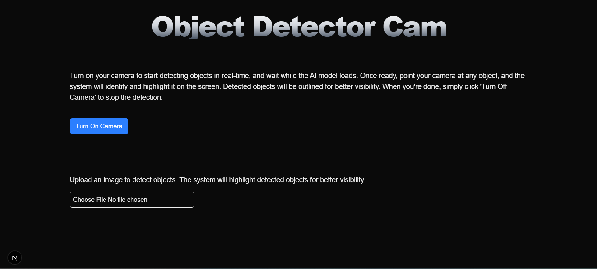

# Object Detector Cam

## Overview



**Object Detector Cam is a Next.js application that utilizes TensorFlow.js and the COCO-SSD model for real-time object detection using a webcam and static image uploads. This project provides an interactive way to detect objects in both live video and uploaded images.**

The app will be available at [Live Link](https://object-detector-zeta.vercel.app/) 🎉.

---

## Features

- **Real-time Object Detection:** Uses the webcam to detect and label objects dynamically.
- **Image-based Detection:** Upload an image to analyze and identify objects within it.
- **TensorFlow.js Integration:** Leverages the COCO-SSD model for object detection.
- **User-Friendly UI:** Built with Tailwind CSS for a clean and responsive design.

---

## Technologies Used

- **Next.js** - Framework for server-side rendering and static site generation.
- **TensorFlow.js** - Machine learning library for browser-based AI models.
- **COCO-SSD** - Pre-trained object detection model.
- **Webcam.js** - For capturing video feed from the webcam.
- **Tailwind CSS** - Styling framework for UI components.

---

## Installation & Setup

### Prerequisites

- Node.js (>= 14.x)
- npm or yarn

### Steps to Install and Run

1. Clone the repository:
   ```bash
   git clone https://github.com/gauravvbh/object-detector.git
   cd object-detector
   ```
2. Install dependencies:
   ```bash
   npm install  # or yarn install
   ```
3. Run the development server:
   ```bash
   npm run dev  # or yarn dev
   ```
4. Open [http://localhost:3000](http://localhost:3000) in your browser to see the app in action.

---

## Project Structure

```
📂 object-detector-cam
├── 📁 _components
│   ├── ObjectDetectionVid.jsx  # Component for real-time object detection
│   ├── ObjectDetectionPic.jsx  # Component for image-based object detection
├── 📁 utils
│   ├── render-predictions.js  # Function to draw bounding boxes on detected objects
├── page.js  # Main entry point for the application
├── package.json  # Project dependencies and scripts
└── README.md  # Project documentation
```

---

## Usage

1. **Real-time Object Detection:**

   - Click on "Turn On Camera" to activate the webcam.
   - The AI model loads and starts detecting objects.
   - Detected objects are highlighted in the live video feed.
   - Click "Turn Off Camera" to stop detection.

2. **Image Upload Detection:**

   - Upload an image file using the file input.
   - The system processes the image and detects objects.
   - Detected objects are listed with confidence scores.
   - Click "Upload Another Image" to restart the process.

---

## Contributing

Contributions are welcome! Feel free to fork this repo, make improvements, and submit a pull request.

---

## License

This project is licensed under the MIT License.

---

## Author

[Gaurav](https://github.com/gauravvbh)
